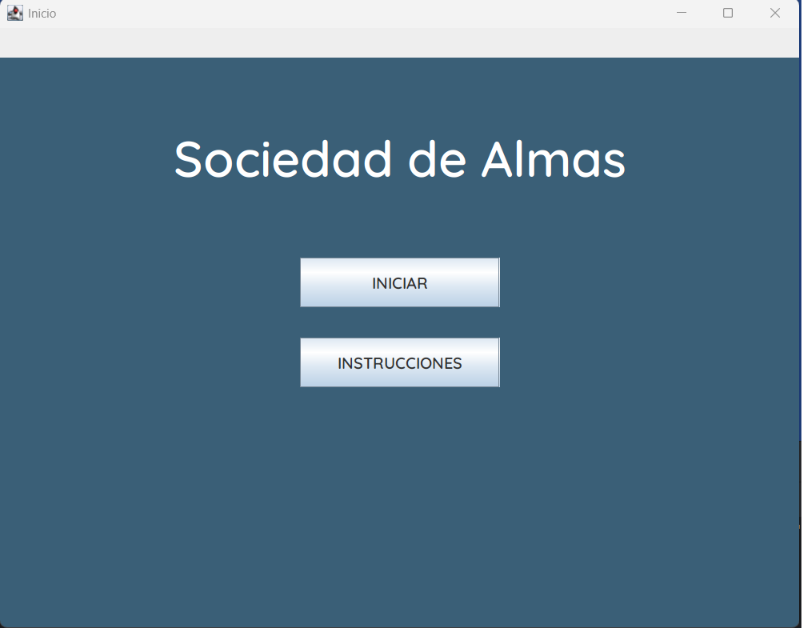

# Sociedad de Almas - Juego 2D

##  Descripción

**Sociedad de Almas** es un videojuego de acción 2D desarrollado en **Java Swing** y **MySQL**.  
El jugador deberá sobrevivir en una ciudad infestada de enemigos, aumentar su **Energía Espiritual** y desbloquear transformaciones especiales como **Shikai** y **Bankai** para derrotar al jefe final.

#  Mecánicas del Juego

##  Jugador

- **Vida (HP):** El jugador inicia con **100 HP**.  
  Si la vida llega a **0**, el juego termina.

- **Energía Espiritual (EE):**  
  Inicia en **0** y puede aumentar hasta **100**.

###  Transformaciones y Habilidades

| Habilidad | Requisito | Ataque Normal | Ataque Especial |
|---|---|---|---|
| Normal | Sin energía | 5 | — |
| Shikai | 50 EE | 10 | 20 |
| Bankai | 100 EE | 15 | 25 |
| Kido | 5 EE | Escalable según transformación | — |

###  Kido

- Normal → 5 daño
- Shikai → 10 daño
- Bankai → 15 daño


##  Enemigos

### Enemigos Normales

- Vida: **10 HP**
- Ataque: **5**
- Aparecen cada **5 segundos**
- Persiguen al jugador constantemente

###  Jefe Final

- Vida: **150 HP**
- Ataque normal: **15**
- Ataque especial: **25**
- El ataque especial inmoviliza al jugador durante **2 segundos**
- Utiliza el ataque especial cada **10 segundos**


##  Entorno

###  Puertas y Cajas

- Las puertas tienen **5 puntos de resistencia**
- Al romperlas se puede acceder a cajas ocultas
- Las cajas otorgan energía espiritual

###  Recompensas

- Derrotar enemigos → **+10 EE**
- Romper cajas → **+5 EE**


#  Sistema de Puntuación

La puntuación final se calcula de la siguiente manera:

| Acción | Puntos |
|---|---|
| Derrotar enemigo normal | +20 |
| Romper puertas/cajas | +10 |
| Activar Shikai o Bankai | +10 |
| Derrotar al jefe final | +300 |

##  Bonus por Salud

| Vida Restante | Bonus |
|---|---|
| 100 HP | +100 |
| 90 HP | +70 |
| 80 HP | +60 |
| 60 HP | +40 |

##  Bonus por Energía Espiritual

Cada punto de **EE restante** al final de la partida se suma a la puntuación total.

#  Flujo del Juego

1. El usuario accede al menú principal.
2. Puede elegir:
   - Ver instrucciones
   - Iniciar partida
3. El usuario ingresa su nombre.
4. Selecciona un personaje.
5. Comienza la partida en la ciudad.
6. El jugador debe:
   - Derrotar enemigos
   - Obtener Energía Espiritual
   - Activar habilidades
   - Derrotar al jefe final
7. Al terminar la partida se muestran:
   - Puntuación final
   - Vida restante
   - Fecha y hora
   - Tiempo total de juego

#  Controles

| Acción | Control |
|---|---|
| Movimiento | WASD / Flechas |
| Ataque | Espacio / Clic |
| Activar habilidades | Teclas asignadas |
| Pausa | Botón en pantalla |
| Ver instrucciones | Botón en menú |
| Salir | Botón en menú |


#  Base de Datos (MySQL)

El proyecto utiliza tres tablas principales para almacenar la información del juego:

- `PERSONAJE`
- `USUARIO`
- `PARTIDA`


##  Script SQL

```sql
CREATE DATABASE sociedad_almas;
USE sociedad_almas;

CREATE TABLE PERSONAJE (
    id_personaje INT AUTO_INCREMENT PRIMARY KEY,
    nombre_personaje VARCHAR(100) NOT NULL,
    descripcion TEXT NOT NULL
);

CREATE TABLE USUARIO (
    id_usuario INT AUTO_INCREMENT PRIMARY KEY,
    nombre_usuario VARCHAR(100) NOT NULL,
    id_personaje INT,
    FOREIGN KEY (id_personaje) REFERENCES PERSONAJE(id_personaje)
);

CREATE TABLE PARTIDA (
    id_partida INT AUTO_INCREMENT PRIMARY KEY,
    id_usuario INT NOT NULL,
    id_personaje_seleccionado INT NOT NULL,
    puntuacion INT NOT NULL,
    vida_restante INT NOT NULL,
    resultado VARCHAR(50) NOT NULL,
    fecha DATETIME NOT NULL DEFAULT CURRENT_TIMESTAMP,
    FOREIGN KEY (id_usuario) REFERENCES USUARIO(id_usuario),
    FOREIGN KEY (id_personaje_seleccionado) REFERENCES PERSONAJE(id_personaje)
);
```

#  Tecnologías Utilizadas

- Java Swing
- Java JDK 17
- MySQL
- JDBC
- GitHub

#  Estructura del Proyecto

```bash
sociedad-de-almas/
│── src/
│   ├── main/
│   ├── personajes/
│   ├── enemigos/
│   ├── interfaces/
│   ├── utilidades/
│── resources/
│── database/
│── README.md
```

#  Instalación y Ejecución

##  Requisitos

- Java JDK 17 o superior
- MySQL Server
- MySQL Connector JDBC

##  Instalación

```bash
# Clonar repositorio
git clone https://github.com/tu-usuario/sociedad-de-almas.git

# Entrar al proyecto
cd sociedad-de-almas
```

### Pasos adicionales

1. Ejecutar el script SQL para crear la base de datos.
2. Configurar las credenciales de MySQL en `ConexionBD.java`.
3. Abrir el proyecto en NetBeans o IntelliJ IDEA.
4. Ejecutar `Main.java`.


#  Capturas del Juego

```md



```


#  Fin del Juego

El juego termina cuando:

- La vida del jugador llega a **0**
- O el jefe final es derrotado

Al finalizar se registra:

- Nombre del usuario
- Puntuación total
- Vida restante
- Resultado (Victoria/Derrota)
- Fecha y hora de la partida


#  Autor

Desarrollado por César — 2026  
Proyecto académico de Programación y Bases de Datos.
